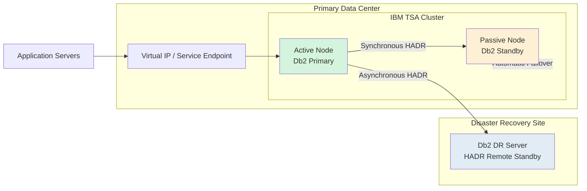

## Problem 1: Near-Zero Downtime DB2 Migration

# Enterprise DB2 Migration Strategy – Near-Zero Downtime

| Document Information | Details |
|---|---|
| Document Version | Draft v1.0 |
| Prepared By | Sunil Raina |
| Date | 21 May 2026 |
| Assessment | HRS DBA Technical Assessment |
| Problem Statement | Problem 1: Near-Zero Downtime DB2 Migration |
| Source Environment | IBM Db2 on AIX |
| Target Environment | AWS RDS for Db2 |
| Objective | Design a highly available, near-zero downtime migration architecture for an 8TB+ transactional Db2 database workload |

## Existing Infrastructure Architecture

### Current Production Environment
- Database Size: 8TB OLTP Production Database
- High Availability: TSA-based Automatic Failover
- Assuming current (DB2 on AIX) Topology:
  - 1 Primary Database Server
  - 1 Standby Server
  - 1 Disaster Recovery (DR) Server
- Operating System: IBM AIX
- Database: IBM Db2
- Architecture Type: Active-Passive Cluster
- Replication Method: Db2 HADR
- Cluster Manager: IBM TSA (Tivoli System Automation)

### Business Requirements
| Requirement | Target |
|---|---|
| Maximum Downtime | 30 Minutes |
| Data Loss | Zero Data Loss |
| Rollback Capability | Within 15 Minutes |
| Data Validation | 100% Data Verification Required |

---

## Assume ths is existing Architecture Diagram

---

## Current State Characteristics

### High Availability
- IBM TSA manages automatic failover between Primary and Standby nodes.
- Virtual IP automatically switches during failover.
- Standby node remains passive until takeover.

### Disaster Recovery
- DR server located in secondary site/region.
- Asynchronous HADR replication used for DR workload.

### Operational Risks
- Large 8TB database increases migration complexity.
- Rollback window is very small (15 minutes).
- Data validation must ensure zero data inconsistency.
- Application outage must remain below 30 minutes.

### Current Recovery Objectives
| Metric | Current Design |
|---|---|
| RPO | Near Zero |
| RTO | Less than 5 Minutes |
| Failover Type | Automatic |
| DR Replication | Asynchronous |
| Local Replication | Synchronous |
