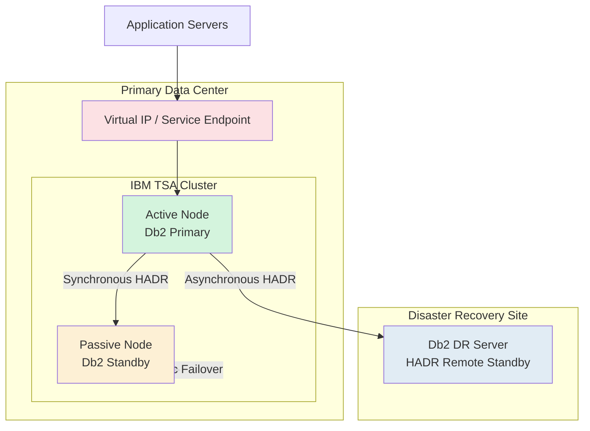
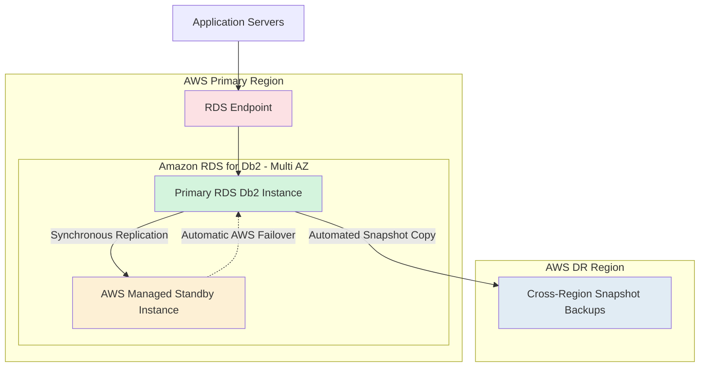

## Problem 1: Near-Zero Downtime DB2 Migration

# Enterprise DB2 Migration Strategy – Near-Zero Downtime

| Document Information | Details |
|---|---|
| Document Version | Draft v1.0 |
| Prepared By | Sunil Raina |
| Date | 21 May 2026 |
| Assessment | HRS DBA Technical Assessment |
| Problem Statement | Problem 1: Near-Zero Downtime DB2 Migration |
| Source Environment | IBM Db2 on AIX |
| Target Environment | AWS RDS for Db2 |
| Objective | Design a highly available, near-zero downtime migration architecture for an 8TB+ transactional Db2 database workload |

## Existing Infrastructure Architecture

### Current Production Environment
- Database Size: 8TB OLTP Production Database
- High Availability: TSA-based Automatic Failover
- Assuming current (DB2 on AIX) Topology:
  - 1 Primary Database Server
  - 1 Standby Server
  - 1 Disaster Recovery (DR) Server
- Operating System: IBM AIX
- Database: IBM Db2
- Architecture Type: Active-Passive Cluster
- Replication Method: Db2 HADR
- Cluster Manager: IBM TSA (Tivoli System Automation)

### Business Requirements
| Requirement | Target |
|---|---|
| Maximum Downtime | 30 Minutes |
| Data Loss | Zero Data Loss |
| Rollback Capability | Within 15 Minutes |
| Data Validation | 100% Data Verification Required |

---

## Assume this is existing Architecture Diagram

---

## Current State Characteristics

### High Availability
- IBM TSA manages automatic failover between Primary and Standby nodes.
- Virtual IP automatically switches during failover.
- Standby node remains passive until takeover.

# Proposed AWS RDS for Db2 Target Architecture

## Target State Design
The proposed AWS architecture replaces traditional Db2 HADR + TSA clustering with AWS managed High Availability using Multi-AZ deployment and Disaster Recovery using Cross-Region Snapshot Backups.

AWS RDS for Db2 does not expose conventional Db2 HADR administration, TSA, Pacemaker, or OS-level clustering. High availability and failover are fully managed by AWS.

---

## AWS Target Architecture Diagram

---

# Proposed Architecture Components

| Component | Purpose |
|---|---|
| Amazon RDS for Db2 Primary | Production database workload |
| Multi-AZ Standby | High availability within AWS region |
| RDS Endpoint | Automatic connection redirection during failover |
| Cross-Region Snapshot Backup | Disaster recovery and regional protection |
| AWS Managed Failover | Automatic failover without TSA/Pacemaker |

---

# High Availability Design

## Multi-AZ Deployment
- AWS automatically maintains synchronous standby replica in another Availability Zone.
- Automatic failover handled by AWS.
- Application reconnects using same RDS endpoint.
- No manual takeover commands required.

## Automatic Failover
During primary failure:
1. AWS detects failure.
2. Standby promoted automatically.
3. DNS endpoint redirected.
4. Application reconnects automatically.

Expected failover duration:
- Typically 60–120 seconds depending on workload and transaction recovery.

---

# Disaster Recovery Design

## Cross-Region Snapshot Strategy
- Automated snapshots copied to secondary AWS region.
- Provides regional disaster recovery capability.
- Supports restoration during complete regional outage.

## DR Recovery Process
1. Restore latest snapshot in DR region.
2. Attach application endpoint.
3. Resume application services.

---

# Comparison with Existing On-Premises Design

| Existing On-Premises | AWS RDS for Db2 |
|---|---|
| Db2 HADR | AWS Managed Replication |
| IBM TSA | AWS Managed Failover |
| Virtual IP | RDS Endpoint |
| Active-Passive Nodes | Multi-AZ Deployment |
| DR Server | Cross-Region Snapshots |
| Manual Cluster Management | Fully Managed Service |
| OS Access | No OS Access |

---

# Enterprise Migration Objectives Alignment

| Requirement | AWS Solution |
|---|---|
| Maximum 30 Minutes Downtime | Controlled Cutover |
| Zero Data Loss | Multi-AZ Synchronous Replication |
| Rollback Within 15 Minutes | Retain Source Environment Until Validation |
| 100% Data Validation | Pre/Post Migration Validation Scripts |
| High Availability | AWS Multi-AZ |
| Disaster Recovery | Cross-Region Snapshot Backup |

### Disaster Recovery
- DR server located in secondary site/region.
- Asynchronous HADR replication used for DR workload.

### Operational Risks
- Large 8TB database increases migration complexity.
- Rollback window is very small (15 minutes).
- Data validation must ensure zero data inconsistency.
- Application outage must remain below 30 minutes.

### Current Recovery Objectives
| Metric | Current Design |
|---|---|
| RPO | Near Zero |
| RTO | Less than 5 Minutes |
| Failover Type | Automatic |
| DR Replication | Asynchronous |
| Local Replication | Synchronous |
