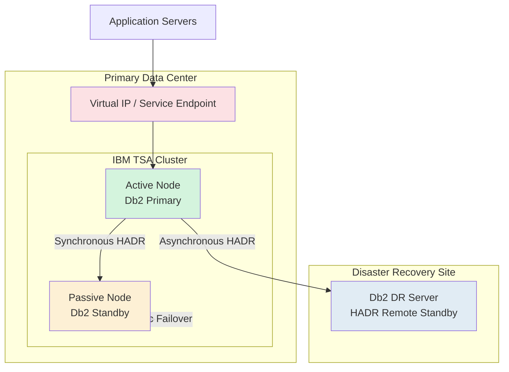
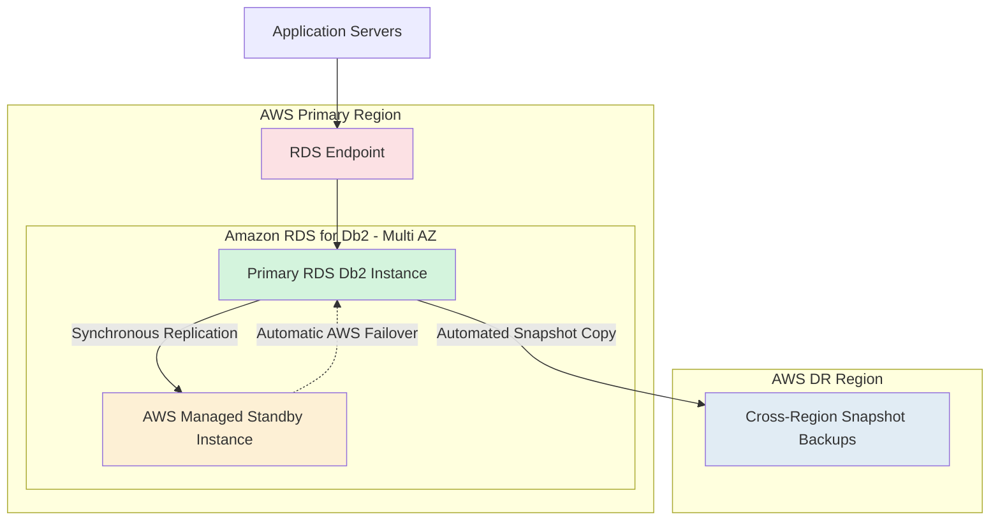

## Problem 1: Near-Zero Downtime DB2 Migration

# Enterprise DB2 Migration Strategy – Near-Zero Downtime

| Document Information | Details |
|---|---|
| Document Version | Draft v1.0 |
| Prepared By | Sunil Raina |
| Date | 21 May 2026 |
| Assessment | HRS DBA Technical Assessment |
| Problem Statement | Problem 1: Near-Zero Downtime DB2 Migration |
| Source Environment | IBM Db2 on AIX |
| Target Environment | AWS RDS for Db2 |
| Objective | Design a highly available, near-zero downtime migration architecture for an 8TB+ transactional Db2 database workload |
# Executive Summary

The proposed solution migrates the existing 8TB IBM Db2 on AIX OLTP environment to AWS RDS for Db2 using a near-zero downtime migration approach based on continuous replication technologies such as IBM Q Replication or IBM CDC.

The target architecture leverages:
- AWS RDS Multi-AZ for High Availability
- Cross-region snapshot replication for Disaster Recovery
- Continuous CDC replication for minimal downtime cutover
- Temporary bi-directional replication for rapid rollback capability

The solution is designed to achieve:
- Less than 30 minutes application downtime
- Zero data loss
- Rollback within 15 minutes
- 100% data validation before production signoff

## Existing Infrastructure Architecture

### Current Production Environment
- Database Size: 8TB OLTP Production Database
- High Availability: TSA-based Automatic Failover
- Assuming current (DB2 on AIX) Topology:
  - 1 Primary Database Server
  - 1 Standby Server
  - 1 Disaster Recovery (DR) Server
- Operating System: IBM AIX
- Database: IBM Db2
- Architecture Type: Active-Passive Cluster
- Replication Method: Db2 HADR
- Cluster Manager: IBM TSA (Tivoli System Automation)

### Business Requirements
| Requirement | Target |
|---|---|
| Maximum Downtime | 30 Minutes |
| Data Loss | Zero Data Loss |
| Rollback Capability | Within 15 Minutes |
| Data Validation | 100% Data Verification Required |

---

## Assume this is existing Architecture Diagram



---


### Current Recovery Objectives
| Metric | Current Design |
|---|---|
| RPO | Near Zero |
| RTO | Less than 5 Minutes |
| Failover Type | Automatic |
| DR Replication | Asynchronous |
| Local Replication | Synchronous |
# Proposed AWS RDS for Db2 Target Architecture

## Target State Design
The proposed AWS architecture replaces traditional Db2 HADR + TSA clustering with AWS managed High Availability using Multi-AZ deployment and Disaster Recovery using Cross-Region Automated Snapshot Replication.

AWS RDS for Db2 does not expose conventional Db2 HADR administration, TSA, Pacemaker, or OS-level clustering. High availability and failover are fully managed by AWS.

---

## AWS Target Architecture Diagram



---

# Proposed Architecture Components

| Component | Purpose |
|---|---|
| Amazon RDS for Db2 Primary | Production database workload |
| Multi-AZ Standby | High availability within AWS region |
| RDS Endpoint | Automatic connection redirection during failover |
| Cross-Region Snapshot Backup | Disaster recovery and regional protection |
| AWS Managed Failover | Automatic failover without TSA/Pacemaker |

---

# High Availability Design

## Multi-AZ Deployment
- AWS automatically maintains synchronous standby replica in another Availability Zone.
- Automatic failover handled by AWS.
- Application reconnects using same RDS endpoint.
- No manual takeover commands required.

## Automatic Failover
During primary failure:
1. AWS detects failure.
2. Standby promoted automatically.
3. DNS endpoint redirected.
4. Application reconnects automatically.

Expected failover duration:
- Typically 60–120 seconds depending on workload and transaction recovery.

---

# Disaster Recovery Design

## Cross-Region Snapshot Strategy
- Automated snapshots copied to secondary AWS region.
- Provides regional disaster recovery capability.
- Supports restoration during complete regional outage.

## DR Recovery Process
1. Restore latest snapshot in DR region.
2. Attach application endpoint.
3. Resume application services.

---

### Operational Risks
- Large 8TB database increases migration complexity.
- Rollback window is very small (15 minutes).
- Data validation must ensure zero data inconsistency.
- Application outage must remain below 30 minutes.

---
# Step 1. Source Environment Assessment

## Capture Current Infrastructure

### Infrastructure Details
- Db2 version and fix pack
- AIX version
- CPU cores and memory
- Filesystem type and allocation
- Storage latency and throughput
- Network bandwidth
- Current HA/DR topology

### Db2 Configuration
- DB CFG
- DBM CFG
- Bufferpool configuration
- Tablespace allocation
- HADR configuration
- Backup strategy
- Maintenance scripts

### Workload Assessment
- Peak TPS
- Peak connections
- CPU utilization
- IO latency
- Bufferpool hit ratio
- Database growth rate

## Purpose
Helps determine:
- Correct AWS RDS sizing
- Storage requirements
- Autoscaling configuration
- Migration throughput
- CDC bandwidth requirements

---

# Step 2. Proposed AWS RDS for Db2 Architecture

## High Availability
- AWS RDS Db2 Multi-AZ deployment
- AWS managed synchronous replication
- Automatic failover

## Disaster Recovery
- Cross-region automated snapshot replication
- Point-in-Time Recovery (PITR)

## Connectivity
- Security Groups for application IPs
- Dedicated replication network for CDC

---

# Step 3. Migration Strategy (Industry Standard)

## Recommended Approach
Use:
- IBM InfoSphere CDC / Q Replication
- Initial Full Load + Continuous CDC Replication

## Why CDC?
For 8TB OLTP databases:
- Backup/restore alone causes long outage
- CDC enables near-zero downtime
- Continuous replication minimizes cutover window

---

# Step 4. Migration Execution Plan

## Phase 1 – Assessment and Planning
- Capture source environment details
- Validate application dependencies
- Size AWS RDS instance
- Define rollback plan
- Define validation strategy

---

## Phase 2 – AWS Environment Build
- Provision AWS RDS for Db2
- Configure Multi-AZ
- Configure backups and DR snapshots
- Configure Security Groups
- Configure monitoring and alerts

---

## Phase 3 – Initial Data Load
- Perform full database export/load
OR
- Use CDC initial snapshot load

## Goal
Reduce remaining delta synchronization during cutover.

---

## Phase 4 – Continuous Replication
- Enable IBM CDC replication
- Replicate ongoing transactions continuously
- Monitor replication latency

## Important
Use dedicated network bandwidth for CDC because:
- 8TB OLTP generates heavy transaction logs
- Prevent replication lag

---

## Phase 5 – Validation
Perform:
- Row count validation
- Object validation
- Checksum validation
- Application connectivity testing
- Performance benchmark testing

## Goal
Ensure 100% data integrity before cutover.

---

# Step 6. Cutover Execution (Downtime Window)

## Planned Cutover Steps

### Step 1
Stop application writes.

### Step 2
Allow CDC replication to reach zero lag.

### Step 3
Final validation check.

### Step 4
Redirect application connection strings to AWS RDS endpoint.

### Step 5
Perform application smoke testing.

### Expected Downtime
Less than 30 minutes.

---

# Step 7. Rollback Strategy
## Recommended Enterprise Rollback Approach

To achieve fast rollback capability within 15 minutes, the migration design keeps the source IBM Db2 on AIX environment active during the stabilization window.

## Proposed Rollback Design
- Keep source Db2 production environment online.
- Preserve archive and active transaction logs.
- Configure IBM CDC in bi-directional replication mode temporarily during cutover validation.
- Redirect application traffic using controlled DNS/connection string changes.

---

# Bi-Directional CDC Strategy

## Purpose
Bi-directional CDC allows:
- Continuous synchronization between source and target environments.
- Rapid rollback without requiring full database restore.
- Minimal data loss during rollback scenarios.
# Replication Technology Considerations

For large enterprise OLTP databases (8TB+), the following replication technologies are commonly used:

| Technology | Use Case | Consideration |
|---|---|---|
| IBM Q Replication | High TPS, enterprise-grade low latency replication | Preferred for mission-critical Db2 workloads |
| IBM CDC | Near-zero downtime migrations | Easier operational management |
| AWS DMS | Cost optimized migrations | Suitable for moderate workloads |
| Kafka Integration | Event streaming and analytics | Used in cloud-native architectures |

## Recommended Approach
For this migration, IBM Q Replication or IBM CDC is recommended due to:
- High transaction volume
- Near-zero downtime requirement
- Enterprise rollback requirements
- Low replication latency needs
## Cost Optimized Choice
For moderate workloads:
- IBM CDC or AWS DMS may be sufficient.

## Modern Cloud-Native Architecture
Organizations adopting event streaming and analytics often integrate:
- CDC + Kafka + AWS services.

---

# Rollback Workflow

## During Migration
```text
Source Db2 on AIX  --->  AWS RDS for Db2
        CDC Replication
```

## During Stabilization Window
```text
Source Db2 <----> AWS RDS for Db2
      Bi-Directional CDC
```

## If Migration Fails
1. Stop application traffic to AWS RDS Db2.
2. Allow reverse CDC synchronization to complete.
3. Redirect application back to source Db2 on AIX.
4. Resume production operations on source system.

---

# Step 8. Post Migration Activities

- Enable automated backups
- Configure CloudWatch monitoring
- Validate Multi-AZ failover
- Performance tuning
- Enable storage autoscaling
- Decommission old environment after signoff

---
## Note : Points to keep in consideration when handling large amount of data.
# Enterprise Best Practices

| Area | Best Practice |
|---|---|
| Migration Method | CDC-based near-zero downtime migration |
| HA | AWS RDS Multi-AZ |
| DR | Cross-region snapshot replication |
| Validation | Automated row count + checksum validation |
| Rollback | Keep source active until signoff |
| Monitoring | CloudWatch + Enhanced Monitoring |
| Security | Security Groups + Encryption |
| Sizing | Peak workload-based sizing |
| Storage | Autoscaling enabled |
| Connectivity | Dedicated CDC network |

---

# Key Industry Recommendations

## Avoid
- Big-bang offline migrations
- Backup/restore-only strategy for 8TB OLTP
- Direct production cutover without CDC
- Decommissioning source immediately

## Recommended
- CDC replication
- Parallel validation
- Dedicated migration network
- Multiple dress rehearsals
- Automated validation scripts
- Controlled rollback plan
---
# Conclusion

The proposed migration approach provides an enterprise-grade strategy for migrating a mission-critical 8TB Db2 OLTP workload from IBM AIX to AWS RDS for Db2 with near-zero downtime.

By combining:
- AWS managed Multi-AZ high availability
- Cross-region disaster recovery
- Continuous CDC/Q replication
- Controlled rollback mechanisms
- Comprehensive validation procedures

the solution minimizes operational risk while meeting business continuity, scalability, and availability objectives.

