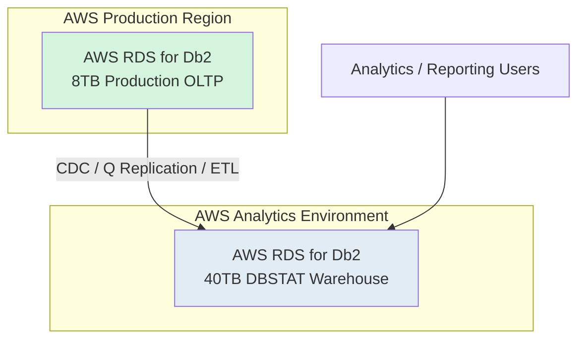
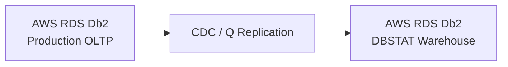

# Problem 1 - Part 2: DBSTAT Data Warehouse Migration Strategy

# Enterprise Data Warehouse Migration – 40TB DBSTAT Warehouse

| Document Information | Details |
|---|---|
| Document Version | Draft v1.0 |
| Prepared By | Sunil Raina |
| Date | 21 May 2026 |
| Assessment | HRS DBA Technical Assessment |
| Source Environment | IBM Db2 on AIX |
| Target Environment | AWS RDS for Db2 |
| Workload Type | Analytical / Reporting Data Warehouse |
| Database Size | 40TB |
| Downtime Tolerance | 48 Hours |

---

# Business Requirements

| Requirement | Target |
|---|---|
| Migration Completion | Within 48 Hours |
| Query Impact | Minimal impact during migration |
| Post Migration Replication | Production → Warehouse replication |
| Availability Requirement | Medium |
| Recovery Objective | Restore analytical services quickly |

---
# Assumptions

- Source and target Db2 versions are compatible for migration.
- Sufficient network bandwidth exists between on-premises and AWS.
- IBM CDC/Q Replication licensing is available if selected.
- Application connection strings can be modified during cutover.
- AWS RDS for Db2 supports required database features and workload sizing.
- Business-approved migration windows are available.
- Production and warehouse workloads are isolated.
  
# Existing Architecture Assumption

## Current Environment
- Separate DBSTAT reporting/data warehouse environment
- Analytical workloads
- Large reporting queries
- ETL/Data ingestion from Production OLTP systems
- Lower transaction rate compared to OLTP production database

---

# Proposed AWS Target Architecture

## Architecture Objective
Migrate the 40TB DBSTAT analytical warehouse to AWS RDS for Db2 and establish continuous replication from the Production AWS RDS Db2 OLTP environment.

---

# AWS Target Architecture Diagram



---
# Migration Rehearsal Strategy

Before production migration:
- Perform at least one full dress rehearsal migration.
- Validate migration duration.
- Validate CDC synchronization timing.
- Validate rollback procedures.
- Benchmark application and reporting performance.
- Document operational runbooks for cutover activities.
- 
# Recommended Migration Strategy

Unlike the OLTP production database:
- 48-hour downtime is acceptable.
- Continuous active-active replication is not required during migration.
- Focus is on:
  - Migration speed
  - Bulk data movement
  - Minimal reporting disruption

---
# Migration Execution Plan
# Why Backup/Restore Preferred Over Continuous Replication for 40TB Warehouse

The migration strategy for the 40TB DBSTAT warehouse differs from the OLTP production database because the workload and business requirements are different.

## Production OLTP Database Requirements
- Maximum 30-minute downtime
- Zero data loss requirement
- High transaction volume
- Near real-time synchronization required

This requires:
- IBM Q Replication
- IBM CDC
- Continuous replication approach

---

## DBSTAT Warehouse Requirements
- 48-hour downtime acceptable
- Primarily analytical/reporting workload
- Lower transactional sensitivity
- Large historical dataset movement

---

## Why Backup/Restore is Preferred

### Faster Large Dataset Migration
For 40TB warehouse databases:
- Native Db2 backup/restore is significantly faster than row-level CDC synchronization.
- Backup/restore transfers data at storage/block level.

### Lower Operational Complexity
Continuous replication for massive historical warehouse datasets may:
- Increase replication overhead
- Generate large CDC lag
- Increase network utilization
- Impact analytical workloads

### Better Fit for Analytical Workloads
The warehouse workload is primarily:
- Read-heavy
- Batch-oriented
- Reporting focused

which makes bulk migration more efficient than continuous transactional replication during initial migration.
## Cost and Transfer Considerations

Although native backup/restore is the preferred approach for large warehouse migrations, the following factors must be evaluated for a 40TB dataset:

| Consideration | Impact |
|---|---|
| Backup storage requirement | Temporary storage cost for compressed backups |
| Network transfer duration | Large data movement may exceed migration window |
| Compression ratio | Impacts transfer size and restore duration |
| Staging storage | Additional storage may be required during migration |
| AWS ingress/storage cost | Impacts overall migration cost |

---

## Enterprise Decision Factors

The final migration approach should be selected based on:

- Available network bandwidth
- Compression efficiency
- Migration window constraints
- Cost optimization requirements
- Operational complexity
- Existing backup infrastructure

---

# Alternative Enterprise Approaches

| Approach | When Preferred |
|---|---|
| Native Backup/Restore | Fastest bulk movement with sufficient bandwidth |
| AWS Snowball | Limited network bandwidth or very large transfer size |
| Parallel Export/Import | Selective or phased migration |
| CDC-Based Initial Load | When continuous synchronization required |

---

# Recommended Approach for This Scenario

For the 40TB DBSTAT warehouse:
- Native compressed backup/restore remains the preferred primary approach if bandwidth and storage costs are acceptable.
- AWS Snowball can be considered if network transfer duration becomes a bottleneck.
- Post migration synchronization should still use CDC/Q Replication from Production OLTP to Warehouse.
---

# Recommended Enterprise Pattern

## Phase 1 – Initial Bulk Migration
Use:
- Native compressed backup/restore
- Parallel restore streams
- AWS Snowball if required

to migrate the historical 40TB dataset efficiently.

---

## Phase 2 – Post Migration Replication
After migration completion:

```text
Production AWS RDS Db2 --> DBSTAT Warehouse AWS RDS Db2
```

using:
- IBM Q Replication
- IBM CDC
- Kafka , can be explored as well.

This enables ongoing near real-time reporting synchronization while keeping OLTP and analytical workloads isolated.
# Recommended Enterprise Migration Approach

## Preferred Strategy
Use:
- Native Backup Restore
OR
- Parallel Export/Import
OR
- AWS Snowball (if network bandwidth insufficient)

followed by:
- CDC/Q Replication from Production OLTP database after migration completion.

---

# Migration Execution Plan

# Phase 1 – Environment Assessment

## Capture
- Warehouse size and growth
- Large tables and partitions
- ETL schedules
- Reporting windows
- Peak analytical workloads
- Compression usage
- Storage consumption

## Purpose
Determine:
- AWS storage sizing
- Query workload requirements
- Migration duration estimation

---

# Phase 2 – AWS Environment Build

## Configure
- AWS RDS for Db2
- Storage autoscaling
- Optimized storage throughput
- Backup strategy
- Security Groups
- Monitoring and alerts

---

# Phase 3 – Initial Bulk Migration

## Recommended Methods

| Method | Use Case |
|---|---|
| Native Backup Restore | Fastest for Db2-to-Db2 |
| Parallel Export/Import | Table-level migration |
| AWS Snowball | Limited network bandwidth |
| rsync/offline copy | Large offline datasets |

## Enterprise Recommendation
For 40TB warehouse:
- Native compressed backup/restore is preferred.
- Parallel restore streams recommended.

---

# Phase 4 – Validation

## Perform
- Row count validation
- Object validation
- ETL validation
- Reporting query validation
- Aggregation consistency checks
- Performance benchmarking

---

# Phase 5 – Enable Ongoing Replication

## Post Migration Requirement
After migration:
```text
Production AWS RDS Db2 --> DBSTAT Warehouse AWS RDS Db2
```

## Recommended Technologies
- IBM Q Replication
- IBM CDC
- Kafka-based ingestion
- ETL tools

---

# Recommended Replication Design

## Production to Warehouse Replication



---
# Monitoring and Observability

The following monitoring capabilities should be enabled:

- AWS CloudWatch Monitoring
- Enhanced RDS Monitoring
- Replication latency monitoring
- Storage autoscaling alerts
- CPU and memory threshold alerts
- Connection utilization alerts
- Backup and snapshot monitoring
- Query performance monitoring

# Why Separate Warehouse Replication?

## Benefits
- Offload reporting from OLTP production database
- Improve production application performance
- Enable large analytical workloads
- Support downstream BI/reporting tools
- Enable near real-time analytics

---

# Minimal Query Impact Strategy

## During Migration
- Perform migration during reporting off-hours if possible.
- Use backup snapshots to reduce production impact.
- Limit long-running extraction queries.
- Use parallelized data movement.

## Goal
Prevent heavy warehouse migration workload from affecting production OLTP operations.

---

# AWS Sizing Considerations

| Area | Purpose |
|---|---|
| Storage Throughput | Large analytical scans |
| Memory Sizing | Query performance |
| CPU Sizing | Aggregation workloads |
| Autoscaling | Future warehouse growth |
| IO Optimization | Reporting performance |

---

# Enterprise Best Practices

| Area | Best Practice |
|---|---|
| Migration Method | Native backup/restore for very large datasets |
| Replication | CDC/Q Replication post migration |
| Reporting Isolation | Separate warehouse instance |
| Validation | Aggregation and ETL validation |
| Storage | Autoscaling enabled |
| Performance | Optimize for analytical workload |
| Monitoring | CloudWatch and Enhanced Monitoring |

---

# Key Industry Recommendations

## Avoid
- Running heavy migration jobs during peak reporting hours
- Direct analytical workloads on OLTP production database
- Single-threaded data movement for 40TB datasets

## Recommended
- Parallel backup/restore
- Compression-enabled backups
- Dedicated warehouse sizing
- Separate replication pipelines
- Post-migration performance tuning

---
# Migration Risks and Mitigation

| Risk | Mitigation |
|---|---|
| CDC replication lag | Dedicated replication bandwidth and monitoring |
| Large data transfer duration | Parallel migration streams and compression |
| Performance degradation after cutover | Pre-cutover performance benchmarking |
| Rollback complexity | Temporary bi-directional CDC replication |
| Application connectivity failures | Pre-validation of endpoints and security rules |
| Storage growth during migration | Enable storage autoscaling |
| Query performance regression | Post-migration workload tuning |
| Network bottlenecks | Dedicated migration/replication network |

# Conclusion

The proposed solution provides a scalable and enterprise-grade migration strategy for the 40TB DBSTAT analytical warehouse to AWS RDS for Db2.

The design:
- Meets the 48-hour migration window
- Minimizes reporting disruption
- Enables ongoing Production-to-Warehouse replication
- Separates OLTP and analytical workloads
- Provides scalable cloud-native reporting architecture
