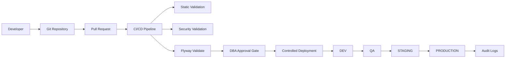
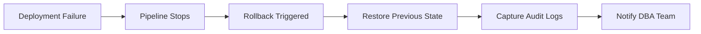

# Enterprise Self-Service Database Operations

| Document Information | Details |
|---|---|
| Document Version | v1.0 |
| Prepared By | Sunil Raina |
| Date | 21 May 2026 |
| Assessment | HRS DBA Technical Assessment |

---

# Design

Design a self-service platform using:

- Version control (GitLab/GitHub)
- CI/CD pipeline
- Flyway or similar schema migration tool
- DBA approval gates
- Audit logging

---

# Current Model

```text
Developer --> Jira Ticket --> DBA Review --> DBA Executes SQL --> Ticket Closure
```

---

# Target Model

```text
Developer --> Git(DB Changes) --> CI/CD Pipeline --> Automated Checks --> DBA approval Gates --> Controlled Deploy --> Maintain Audit logs
```

---

# Proposed Design

## Reference Architecture



---

# Step 1: Version Control - Git as Single Source

## Components

1. SQL Scripts (DDL/DML) or SQL
2. Flyway/Liquibase Migrations

---

## Notes

### Flyway

- Simpler adoption
- Sequential migrations
- Easier integration with CI/CD

### Liquibase

- Alternative solution
- XML/YAML-based migrations
- Advanced enterprise governance support

---

## Repository Structure

```text
/db_repo
    /migrations
        /schema
            v1_init.sql
            v2_add_table.sql

        /datafix

        /security

        /maintenance

    /rollback

    /config
```

---

## Benefits

1. Full history
2. Peer Review using PR
3. Easy rollback

---

# Step 2: Migration Tools (Flyway/Liquibase)

## Recommended: Flyway (Simpler Adoption)

## Uses

1. Maintain the schema versions
2. Migrations are done in sequence
3. Deployment status can be tracked easily

---

## Example

Developer commits:

```text
v15_add_index.sql
```

Pipeline execution:

```text
flyway validate
flyway migrate
```

This gives flexibility to validate before actually deploying code.

---

# Step 3: CI/CD Pipeline

## Recommended Tool

Jenkins can be used here.

---

## Notes

Based on the R&D, same implementation can also be done using:

- Azure DevOps
- GitHub Actions

But Jenkins and Bamboo are widely used industry tools.

---

# Stage 1: Pre-Validation

## Static Checks

1. No DROP statements without `IF EXISTS`
2. No DELETE statements without `WHERE` condition
3. Use of REPLACE in case temp tables are used in Stored Procedures
4. No `SELECT *` used in Stored Procedures
5. Stored Procedures must have `CREATE OR REPLACE`
6. Functions/Views/Triggers must use `CREATE OR REPLACE`
7. Additional static validation parameters can also be added

---

## Security Checks

1. No hardcoded user/instance credentials
2. Sensitive data validations
3. No use of PII data in INSERT or UPDATE statements
4. No use of `SELECT *` on production

---

# Stage 2: Build & Test

This can be explored using:

- Bash scripts
- Python scripts

Validation approach:

- Create dummy schema
- Execute scripts
- Validate execution
- Validate dependencies

---

# Stage 3: DBA Approval Gate (Risk Based)

## Approval Needed in Case Of

### High Impact Changes

1. Alter large table
2. Alter data type:
   - CHAR to VARCHAR
   - INT to DECIMAL
   - NULL to NOT NULL
3. Drop operations

---

## Production Deployments

DBA approval required before production deployment.

---

## Notes

We can use:

- GitHub Protection Rules
- Azure DevOps Approvals
- Jenkins Approval Stages

---

# Stage 4: Deployments

## Auto Deploy Flow

```text
DEV --> QA --> STAGING --> PROD
```

If staging is not available:

```text
DEV --> NON-PROD --> PROD
```

---

## Deployment Execution

Flyway executes the migration.

---

## Additional Considerations

- Zero downtime deployment approaches can be implemented

---

# Step 4: Audit and Logging

## Must Capture Below Details

1. User who submitted the change in Jira
2. DBA who approved the change
3. Which SQL statement was executed
4. Date of deployment
5. Success or Failure code

---

# Toolset

We can use Flyway.

`flyway_schema_history` provides execution-level logging information.

---

## Note

1. Liquibase can also be explored as an alternative to Flyway.
2. DB2 also has the native utility db2audit which captures DML, and Data movement utilities
3. DMC - Is another Web-based tool (Data Management Console) which captures below listed item in wider scale:
   a. Enable activity event Monitors
   b. It captures DML , DCL, Utilities like (reorg, reorgchk, runstats, backups etc)
4. Home written scripts using Bash/Python can be written to do capture these work streams.
5. Guardium  tool is one of the widly adopted tool for compliance to capture the authorized and unauthized access on execution of the DML operations.

---
# Step 5: Rollback Strategy

Each deployment must include rollback capability.

---

## Rollback Requirements

1. Rollback SQL mandatory
2. Point-in-time recovery readiness
3. Backup validation before deployment
4. Rollback testing in lower environments

---

## Rollback Architecture



---

# Net-Net Workflow

1. Developer creates new branch and creates new file based on:
   - DML
   - DDL
   - DCL
   - Maintenance

---

## Stored Procedure Note

For existing Stored Procedures:

- Zero Version must exist
- Developer checks out existing version
- Modifications done in development branch

---

## Workflow Steps

1. Code committed
2. PR raised
3. Automatic CI checks triggered
4. DBA reviews PR (only if needed)
5. Merge triggers CD pipeline
6. Pre-prod validation steps
7. DBA approval gate for production
8. Flyway validates and migrates in production
9. Logs stored for audit
